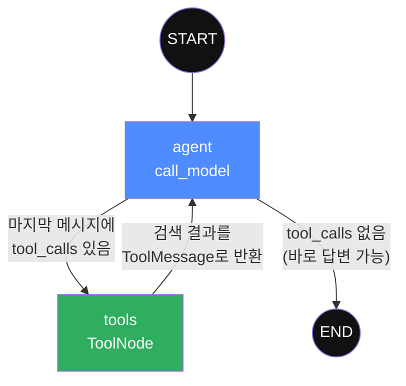
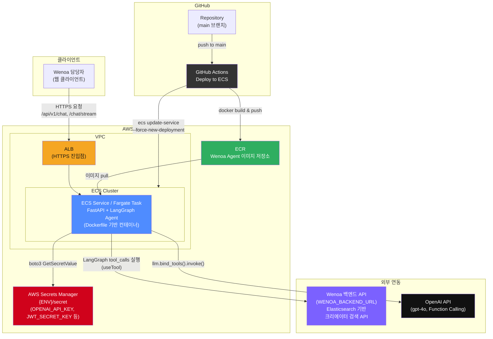

# Wenoa Agent

Wenoa 서비스의 인플루언서 마케팅 캠페인 준비 단계에서, **자연어 요청만으로 조건에 맞는 크리에이터(유튜브/인스타그램/틱톡)를 검색**해주는 LangGraph 기반 AI 에이전트입니다.

## 목차

- [문제 정의](#문제-정의)
- [해결 방법: LangGraph 에이전트](#해결-방법-langgraph-에이전트)
- [기대 효과](#기대-효과)
- [LangGraph 그래프 구조](#langgraph-그래프-구조)
- [AWS 서버 아키텍처](#aws-서버-아키텍처)
- [기술 스택](#기술-스택)
- [API](#api)

---

## 문제 정의

캠페인 담당자가 조건에 맞는 인플루언서를 찾으려면, 기존에는 Elasticsearch 기반 검색 화면에서 아래 항목들을 **모두 사람이 직접 설정**해야 했습니다.

- 검색어(키워드)
- 구독자 수 범위
- 평균 댓글 수 / 평균 좋아요 수
- 광고 콘텐츠 반응(광고 영상 평균 조회수·좋아요·댓글)
- 숏츠(Shorts) 비율
- 국가, 언어, 카테고리 등

이 과정의 비효율은 다음과 같습니다.

1. **파라미터 설계 부담**: "20대 여성 타겟 뷰티 인플루언서, 반응 좋은 사람" 같은 캠페인 요구사항을 담당자가 직접 검색 필드(구독자 수 구간, 카테고리 코드, 정렬 기준 등)로 번역해야 함
2. **툴 학습 비용**: 필터 항목이 많고 의미가 도메인 지식(예: 카테고리 코드, 광고 지표 정의)에 의존적이라 신규 담당자의 진입장벽이 높음
3. **반복 시행착오**: 원하는 결과가 안 나오면 필터 값을 바꿔가며 재검색을 반복 → 리스트업 한 건당 소요 시간 증가

## 해결 방법: LangGraph 에이전트

기존 검색 API(Elasticsearch 기반)는 그대로 백엔드에 두고, 그 앞단에 **LangGraph로 구성한 대화형 에이전트**를 두어 자연어 요청을 검색 파라미터로 자동 변환합니다.

```
"구독자 10만 이상, 뷰티 카테고리, 광고 콘텐츠 댓글 반응 좋은 유튜버 5명 찾아줘"
                    │
                    ▼
        LangGraph Agent (LLM Function Calling)
                    │  자연어 → 구조화된 검색 파라미터 추출
                    ▼
        search_youtube_creators(
          categories=[1], subscriber_min=100000,
          sort_type="ad_video_comment_avg", size=5
        )
                    │  useTool → 기존 Elasticsearch 검색 API 호출
                    ▼
              검색 결과(JSON)
                    │  LLM이 다시 자연어로 요약
                    ▼
         "조건에 맞는 뷰티 유튜버 5명을 찾았어요: ..."
```

핵심 아이디어는 **"자연어 → 함수 인자 추출"은 LLM에게, "함수 인자 → 실제 검색 API 호출"은 LangGraph에게** 역할을 분리한 것입니다.

- LLM은 `@tool`로 등록된 함수의 시그니처와 docstring(파라미터 설명, 카테고리 매핑표, 정렬 옵션 등)을 OpenAI Function Calling 스키마로 전달받아, 사용자의 자연어 요청에서 `search_key`, `subscriber_min/max`, `categories`, `ad_comment_avg_min/max`, `sort_type` 등을 스스로 채워 넣습니다.
- LLM은 이 파라미터를 실제로 실행하지 않고 `tool_calls` 형태의 호출 의도만 생성하며, LangGraph의 `ToolNode`가 이를 받아 실제 Python 함수(`app/tools/youtube.py` 등)를 실행해 기존 검색 API(`WENOA_BACKEND_URL`)를 호출합니다.
- 인증 토큰은 LLM이 다루지 않도록 `ContextVar`로 분리 전달하여, 프롬프트 인젝션이 발생해도 토큰이 노출되지 않도록 설계했습니다.
- `thread_id`(user_id) 기준 체크포인터(`MemorySaver`)로 멀티턴 대화 맥락(예: "그중에서 구독자 더 많은 사람만 다시 보여줘")도 유지됩니다.

즉, 기존 검색 시스템의 필터링 로직/데이터는 그대로 재사용하면서, **사람이 검색 파라미터를 직접 설계하던 단계만 에이전트로 대체**한 구조입니다.

## 기대 효과

- **업무 효율화**: 담당자가 필터 항목의 의미와 코드값을 몰라도, 캠페인 요구사항을 말하듯 요청하면 검색 파라미터 설계가 자동으로 이루어짐
- **리스트업 시간 단축**: 파라미터 조합 시행착오 없이 한 번의 자연어 요청으로 원하는 조건의 크리에이터 리스트 획득
- **진입장벽 완화**: 신규 담당자도 도메인 지식(카테고리 코드, 광고 지표 정의 등) 없이 바로 업무 수행 가능
- **대화형 탐색**: 단발성 검색이 아니라 멀티턴 대화로 조건을 좁혀가며 리스트업 가능

---

## LangGraph 그래프 구조

`app/agent/agent.py`에 정의된 그래프는 `agent`(LLM 호출)와 `tools`(실제 API 호출) 두 노드가 조건부 엣지로 순환하는 구조입니다.



### 노드별 역할

| 노드 | 구현 위치 | 역할 |
|---|---|---|
| **START** | `langgraph.graph.START` | 그래프의 진입점. `process_message`/`stream_message`가 만든 초기 State(`SystemMessage` + `HumanMessage`)로 그래프 실행을 시작 |
| **agent** | `call_model` (`app/agent/nodes.py`) | `ChatOpenAI`(`gpt-4o`, `temperature=0`)에 `bind_tools`로 3개의 검색 도구를 바인딩한 LLM을 호출. 대화 히스토리(`state["messages"]`)를 통째로 넣어, ① 도구 호출이 필요하면 `tool_calls`가 채워진 메시지를, ② 바로 답할 수 있으면 최종 답변 메시지를 반환 |
| **conditional edge (agent → tools / END)** | `agent.py`의 `add_conditional_edges` | `state["messages"][-1].tool_calls` 존재 여부만 보는 순수 함수. 도구 호출 의도가 있으면 `tools`로, 없으면 `END`로 라우팅 |
| **tools** | `ToolNode(tools)` (`app/agent/nodes.py`, LangGraph 사전 제공 노드) | `agent`가 생성한 `tool_calls`를 실제로 실행하는 노드. 여기서 비로소 `search_youtube_creators` / `search_tiktok_creators` / `search_instagram_creators`(`app/tools/*.py`)가 실행되어 `httpx`로 기존 Elasticsearch 기반 검색 API(`WENOA_BACKEND_URL`)를 호출하고, 응답을 `ToolMessage`로 State에 추가 |
| **tools → agent** | 고정 엣지 | 검색 결과가 담긴 `ToolMessage`를 가지고 다시 `agent` 노드로 돌아가, LLM이 결과를 사람이 읽기 좋은 자연어로 요약 |
| **END** | `langgraph.graph.END` | 더 이상 호출할 도구가 없을 때(최종 자연어 답변 완성 시) 그래프 종료. `final_state["messages"][-1].content`가 사용자에게 반환됨 |

부가적으로:

- **State (`AgentState`, `app/agent/state.py`)**: LangGraph 제공 `MessagesState`를 그대로 상속. `messages` 필드가 `add_messages` reducer로 선언되어 있어, 각 노드는 "새로 추가된 메시지"만 반환하면 LangGraph가 자동으로 히스토리에 append
- **체크포인터 (`MemorySaver`)**: `thread_id`(=user_id) 단위로 그래프 State(대화 히스토리)를 저장/복원하여 멀티턴 대화를 지원
- **스트리밍**: `astream_events(version="v2")`로 `agent` 노드의 토큰 스트림(`on_chat_model_stream`)과 `tools` 노드 진입 시점(`on_tool_start`)을 SSE로 클라이언트에 전달해, "검색 중..." 같은 중간 상태 표시가 가능

---

## AWS 서버 아키텍처

> 레포 내 CI/CD 워크플로우(`.github/workflows`), `Dockerfile`, `app/core/secret.py`(AWS Secrets Manager 연동)를 근거로 구성한 다이어그램입니다.



### 구성 요소 설명

- **GitHub Actions (`.github/workflows`)**: `main` 브랜치 push 시 Docker 이미지를 빌드해 ECR에 push하고, `aws ecs update-service --force-new-deployment`로 ECS 서비스를 강제 재배포하는 CI/CD 파이프라인
- **ECR**: 빌드된 Wenoa Agent 컨테이너 이미지 저장소
- **ECS (Fargate 추정)**: FastAPI 애플리케이션(`app/main.py`, `uvicorn`)을 컨테이너로 실행하는 서비스. `/api/v1/chat`, `/api/v1/chat/stream` 엔드포인트를 통해 에이전트 요청을 처리
- **AWS Secrets Manager**: `ENV`가 `local`이 아닌 경우(`app/core/config.py`) `{ENV}/secret`라는 이름으로 `OPENAI_API_KEY`, `JWT_SECRET_KEY` 등 민감 설정을 조회해 환경변수와 병합. 코드/이미지에 시크릿을 직접 담지 않기 위한 구성
- **Wenoa 백엔드 API**: 기존 Elasticsearch 기반 크리에이터 검색 API. 에이전트가 대체한 것은 "이 API를 호출하기 위한 파라미터 설계" 단계이며, 실제 검색/필터링 로직과 데이터는 이 백엔드가 그대로 담당
- **OpenAI API**: LangGraph `agent` 노드가 Function Calling에 사용하는 LLM(`gpt-4o`)

---

## 기술 스택

- **Framework**: FastAPI, Uvicorn
- **Agent**: LangGraph, LangChain(OpenAI)
- **HTTP Client**: httpx (백엔드 검색 API 호출)
- **Auth**: python-jose(JWT)
- **Infra**: Docker, AWS ECS/ECR, AWS Secrets Manager, GitHub Actions

## API

| Method | Path | 설명 |
|---|---|---|
| `POST` | `/api/v1/chat` | 자연어 메시지를 받아 에이전트 처리 후 최종 답변(`ChatResponse`) 반환 |
| `POST` | `/api/v1/chat/stream` | 위와 동일하되 SSE(Server-Sent Events)로 토큰 단위 스트리밍 응답 |

`ChatResponse`에는 최종 답변(`answer`)뿐 아니라, 도구 호출 여부로 판단한 `intent`(`CREATOR_SEARCH`/`CHAT`)와 사용된 도구명(`tool_used`)이 함께 반환되어, 프론트엔드에서 검색 결과 UI를 별도로 분기 처리할 수 있습니다.
